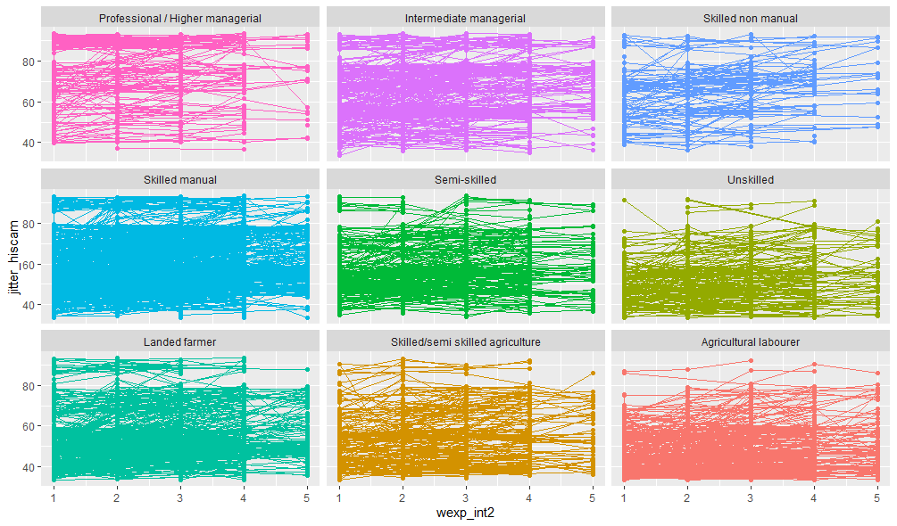

@import "../css/datavis.less"

```elm {l=hidden}
import Tidy exposing (..)
import VegaLite exposing (..)
```

# Postgraduate Coursework Template

Some background first. I am interested in using visualization for exploring the data I used in a previous master´s thesis which can be found [here](https://0-www-sciencedirect-com.wam.city.ac.uk/science/article/pii/S0276562415000694). The basic idea behind it is the following: Industrialization had a profound effect on british society, triggering a shift in its occupational structure due to the increasing demand of more technical manual and non manual labour. This led to more social mobility, and ultimately, to a decrease in the effect of one´s social background on an individual´s occupational achievement. Meaning that british society become more open.

The Data I used correspond to Data from the Longitudinal Study of Residential Histories (Pooley & Turnbull, 1996) -LRSH from now on-. This dataset consists of a large sample of high-quality longitudinal data on individual residential histories from the eighteenth century to the twentieth century in Britain. Although the main purpose behind the data collection was to gather information on the history of individuals’ residential moves, the occupation of individuals was recorded before and after each residential move, resulting in between 1 and 67 occupations per person, and 41,205 occupational measurements for 6229 men born in Britain between 1780 and 1880 who were in the labour market between 1790 and 1950.

I filtered some observations from this data. First, I dropped occupational measurements corresponding to Domestic Service and Army occupations. I did this because I wanted to simplify the analysis and also, because there are very few observations for these categories. I also filtered out observations that were not from the UK (e.g. people who moved in from other countries). Occupational measurements of people older than 60 were also filtered out, as it is more likely that, surviving to that age and still working, would be a highly selective group, and thererofe any generalization from that data would be particularly biased. The final dataset consist of 35813 occupational measurements of 5967 men and is available from [here](https://github.com/csmontt/dataVisCourse).

To be able to distinguish how the occupational status of an individual changed over his career, to each occupation a HISCAM status score was assigned (Van Leeuwen, M. H. D., Maas, I., & Miles, A., 2004).

The resulting HISCAM averages for each occupation can be seen in the table below. They are ordered as they appear in the visualization made in Litvis.

| Occupation                       | HISCAM  | Area        |
| -------------------------------- | ------- | ----------- |
| Professional / higher managerial | 89.6    | Industry    |
| Intermediate managerial          | 75.6    | Industry    |
| Skilled non manual               | 67.7    | Industry    |
| Skilled manual                   | 55.4    | Industry    |
| Semi-skilled                     | 48.2    | Industry    |
| Unskilled                        | 45.3    | Industry    |
| Landed farmer                    | 49.3    | Agriculture |
| Skilled/semi skilled agriculture | 40.2    | Agriculture |
| Agricultural labourer            | 37.4    | Agriculture |

I would like to explore the same questions from the article were this data came from, but using visualization. These questions are:

{(questions|}

- Did men have more successful careers in Britain as the country became industrialised?
- Did British society became more open during industrialisation?

{|questions)}

{(visualization|}

```elm {l=hidden}
occColours =
    categoricalDomainMap [( "Agricultural labourer", "#A50F15"),
                ( "Skilled/semi skilled agriculture", "#DE2D26" ),
                ( "Landed farmer", "#FB6A4A" ),
                ( "Unskilled", "#9ECAE1" ),
                ( "Semi-skilled", "#6BAED6" ),
                ( "Skilled manual", "#4292C6" ),
                ( "Skilled non manual", "#2171B5" ),
                ( "Intermediate managerial", "#08519C" ),
                ( "Professional / Higher managerial", "#08306B" )]

occOrd =
    transform -- CHANGE ORDER SO LABEL ORDER ALSO CHANGES
      << calculateAs """if(datum.occ == 'Professional / Higher managerial', 8,
                         if(datum.occ == 'Intermediate managerial', 7,
                          if(datum.occ == 'Skilled non manual', 6,
                           if(datum.occ == 'Skilled manual', 5,
                            if(datum.occ == 'Semi-skilled', 4,
                             if(datum.occ == 'Unskilled', 3,
                              if(datum.occ == 'Landed farmer', 2,
                                if(datum.occ == 'Skilled/semi skilled agriculture', 1, 0))))))))"""
                     "occOrder"

cohoColors =
   categoricalDomainMap [( "1855-1880", "#014636"),
               ( "1830-1854", "#3690C0" ),
               ( "1805-1829", "#A6BDDB" ),
               ( "1780-1804", "#D0D1E6" )]


transOrd =
  transform
    << calculateAs """if(datum.rcodefa == 'Professional / Higher managerial', 8,
                        if(datum.rcodefa == 'Intermediate managerial', 7,
                        if(datum.rcodefa == 'Skilled non manual', 6,
                        if(datum.rcodefa == 'Skilled manual', 5,
                        if(datum.rcodefa == 'Semi-skilled', 4,
                        if(datum.rcodefa == 'Unskilled', 3,
                        if(datum.rcodefa == 'Landed farmer', 2,
                        if(datum.rcodefa == 'Skilled/semi skilled agriculture', 1, 0))))))))"""
                        "codefaOrder"

occData =
   dataFromUrl "https://raw.githubusercontent.com/csmontt/dataVisCourse/master/data/courseworkData.csv"

```

```elm {l=hidden }
occLegend : Spec
occLegend =
    let

        cfg =
            configure
               << configuration (coView [ vicoStroke Nothing ])

        enc =
            encoding
                -- Just encode in the Y position direction to create column of marks
                << position Y
                    [ pName "occ"
                    , pMType Nominal
                    , pAxis [ axTitle "", axDomain False, axTicks False ]
                    , pScale [ scDomain (doStrs [ "Professional / Higher managerial"
                                                , "Intermediate managerial"
                                                , "Skilled non manual"
                                                , "Skilled manual"
                                                , "Semi-skilled"
                                                , "Unskilled"
                                                , "Landed farmer"
                                                , "Skilled/semi skilled agriculture"
                                                , "Agricultural labourer" ]) ]
                    ]
                << color
                        [ mName "occ", mMType Nominal, mScale cohoColors, mLegend [] ]

    in
    asSpec [ occData [], occOrd [], enc [], circle [ maSize 120, maX -155 ], cfg[] ]
```


```elm {l=hidden}
interactiveLegend : String -> String -> Spec
interactiveLegend field selName =
    let
        enc =
            encoding
                -- Just encode in the Y position direction to create column of marks
                << position Y
                    [ pName field
                    , pMType Nominal
                    , pAxis [ axTitle "", axDomain False, axTicks False ]
                    , pScale [ scDomain (doStrs [ "1855-1880"
                                                , "1830-1854"
                                                , "1805-1829"
                                                , "1780-1804"
                                                 ]) ]
                    ]
                << color
                    [ mSelectionCondition (selectionName selName)
                        [ mName field, mMType Nominal, mScale occColours, mLegend [] ]
                        [ mStr "lightgrey" ]
                    ]

        sel =
            selection
                << select selName seMulti [ seEncodings [ chColor ] ]
    in
    asSpec [ sel [], enc [], square [ maSize 120, maOpacity 1 ] ]
```

```elm {v l=hidden interactive}
mapOccs3 : Spec
mapOccs3 =

    let

        cfg =
            configure
                << configuration (coView [ vicoStroke Nothing ])
                << configuration (coTitle [ ticoAnchor anStart ])
                << configuration (coAxis [ axcoTicks False, axcoDomain False ])

        sel =
            selection
                << select "brush" seInterval []

        transBrush =
            transform
                << filter (fiSelection "brush")

        encContext =
            encoding
                << position X [ pName "lon"
                    , pMType Quantitative
                    , pScale [ scDomain (doNums [ -8, 2 ]) ]
                    , pAxis [axGrid False, axTitle "", axValues [], axTicks False ]
                    ]
                << position Y [ pName "lat"
                    , pMType Quantitative
                    , pScale [ scDomain (doNums [ 49, 61 ]) ]
                    , pAxis [axGrid False, axTitle "", axValues [], axTicks False]
                    ]

                << color
                [ mSelectionCondition (selectionName "brush")
                    [ mName "occ"
                    , mMType Nominal
                    , mScale occColours
                    , mLegend []
                    ]
                    [ mStr "lightgrey" ]
                ]


        specContext =
            asSpec [ width 240, height 315, sel [], circle [ maSize 2, maOpacity 0.5 ]
                     , encContext []
                     , title "UK's occupational map (brush a selection)"
                     ]

-- faceted by cohort
        encDetailArea =
             encoding
                 << position Y
                    [ pMType Quantitative
                    , pAggregate opCount -- Count up frequencies in each group
                  --  , pStack stNormalize -- Make all bars the same height
                  --  , pStack stCenter -- Stack are centred
                    , pAxis [axTitle ""]
                     ]

                 << position X
                    [ pName "cohort"
                     , pMType Ordinal
                     , pAxis [ axTitle "", axGrid False, axLabelAngle 300  ]
                     ]

                 << color
                     [ mName "occ"
                     , mMType Nominal
                     , mScale occColours
                     , mLegend [ ]
                     ]

                  << order
                      [ oName "occOrder"
                      , oMType Quantitative
                      ]

        specDetailArea =
              asSpec [ width 330, height 115, bar [], encDetailArea []
              , transBrush [], title "Occupational measurements over cohorts"
              ] --, height 100

        encDetailAreaNorm =
              encoding
                   << position Y
                      [ pMType Quantitative
                      , pAggregate opCount -- Count up frequencies in each group
                      , pStack stNormalize -- Make all bars the same height
                      , pAxis [axTitle "", axTitlePadding 23]
                      ]

                   << position X
                      [ pName "cohort"
                      , pMType Ordinal
                      , pAxis [ axTitle "", axGrid False, axValues [] ]
                      ]

                   << color
                      [ mName "occ"
                      , mMType Nominal
                      , mScale occColours
                      , mLegend [ ]
                      ]

                  << order
                      [ oName "occOrder"
                      , oMType Quantitative
                      ]

        specDetailAreaNorm =
             asSpec [ width 330, height 110, bar [], encDetailAreaNorm []
                     , transBrush [], title "Proportion of occupations over cohorts"
                     ]


        hiscamAge =
             transform
                  << filter (fiSelection "brush")
                  << filter (fiSelection "legendSel")
                  << window [ ( [ wiAggregateOp opMean
                     , wiField "hiscam_age" ], "avHcoho" ) ]
                     [ wiGroupBy [ "cohort", "age_int" ]
                     , wiFrame Nothing Nothing ]

        encStatusContext =
             encoding
                  << position X [ pName "age_int"
                      , pMType Ordinal
                      , pAxis [ axGrid False
                      , axTitle "Age"
                      , axTitleFontSize 7
                      , axLabelAngle 300 ]
                      ]

                  << position Y [ pName "avHcoho"
                      , pMType Quantitative
                      , pScale [ scZero False ]
                      , pAxis [ axTitle "" ] ]

                 << color [ mName "cohort"
                      , mMType Nominal
                      , mLegend [] -- leValues (leStrs ["1780 - 1804", "1805 - 1829", "1830 - 1854", "1855 - 1880"])
                      , mScale cohoColors
                      ]

        specEncStatusContext =
             asSpec [ width 680, height 100, line [maInterpolate miMonotone] -- maPoint (pmMarker [])
                      , encStatusContext [], hiscamAge []
                      , title "Differences in occupational status (average HISCAM) over the life course between cohorts"]


        hiscamAge2 =
             transform
                  << filter (fiSelection "brush")
                  << filter (fiSelection "legendSel")
                  << window [ ( [ wiAggregateOp opMean
                     , wiField "hiscam_age" ], "avHcoho" ) ]
                     [ wiGroupBy [ "cohort", "rcodefa", "age_int" ]
                     , wiFrame Nothing Nothing ]

        encStatusDetail =
            encoding
                  << position X [ pName "age_int"
                     , pMType Ordinal
                     , pAxis [ axGrid False, axTitle "", axTicks False, axValues [] ] ]

                  << position Y [ pName "avHcoho"
                     , pMType Quantitative
                     , pScale [ scZero False ]
                     ,  pAxis [ axTitle "" ] ]

                  << color [ mName "cohort"
                     , mMType Nominal
                     , mLegend []
                     , mScale cohoColors
                     ]

                  << column [ fName "rcodefa"
                     , fMType Nominal
                     , fSort [ soCustom (strs ["Professional / Higher managerial"
                                              ,"Intermediate managerial"
                                              ,"Skilled non manual"
                                              ,"Skilled manual"
                                              ,"Semi-skilled"
                                              ,"Unskilled"
                                              ,"Landed farmer"
                                              ,"Skilled/semi skilled agriculture"
                                              ])]
                    , fHeader [ hdTitle ""
                              , hdLabelAngle 352
                              , hdLabelFontSize 8
                              ]

                     ]

        specStatus =
            asSpec [width 60, height 70, line [maInterpolate miMonotone] --,  maPoint (pmMarker [maSize 5])
                   , encStatusDetail [], hiscamAge2 []
                   , title "The Effect of Father's Occupation on an Individuals Career" ]

        in
        toVegaLite
        [ occData []
        , cfg []
        , occOrd []
        , vConcat [
                   asSpec [ hConcat [specContext, asSpec[vConcat[specDetailAreaNorm, specDetailArea]], occLegend]
                  ]
        , asSpec [hConcat[ specEncStatusContext, interactiveLegend "cohort" "legendSel"]], specStatus ]
        ]
```


{|visualization)}

{(insights|}

Though I did not considered the spatial variation of occupations over the UK at the beginning, I decided to include it in the visualization. In this way, now I am able to compare the evolution of the occupational structure and the development of individual careers between specific regions. It also allows me to see that the data used seems to be representative of the whole of the UK. Something I had not explore before.

If we have a look at the whole dataset, some interesting patterns emerge. First, the map shows that ocupations related to industry are concentrated around urban areas, such as London or Manchester. It is also possible to notice that, further in the past, the number of occupations related to agriculture (i.e. Agricultural Laborer, Skilled / semi - skilled agriculture laborer, landed farmer ) were larger, around 40%, and that over the years they decreased rapidly. Is important to note that the change does not look that drastic cause we are looking at occupations of individuals born between large periods of time (cohorts), therefore the larger difference at the beginning of the 1780s produced by industrialization are not that salient. Nonetheless, the message is the same, a persistent decrease of agricultural occupations giving space to the rise of industry related jobs. Furthermore, we can have a look at the number of records per occupation over cohorts. this tell us something about the data: further in the past the less observations we have. Probably, any inference that we make from older data (the first cohort) should be done with precaution, specially if we select a region in the map and we see that the number of observations for certain occupations are too low.

The next vis allows us to answer whether individuals careers became more succesful or not over the years. As the graph shows, in average, people started their careers at a lower occupational status in the past, and, even though they achieve higher status over their life course, the differences between cohorts remained. This means that british men's career did become more 'succesful' over the years. Understanding succesful, as achieving jobs of higher status as measured by the HISCAM scale.

The final vis tells us about how the influence of the father's occupation exerts a life long effect on the occupational status achieved by their sons. The occupation of the father is ordered from highest occupational status (Professional / Higher managerial: 89.6) to lowest (Agricultural farmer: 37.4). Actually, the only exception is Lander Farmer, which should have been between Skilled-manual and Semi-skilled, I'll justify this decision in the next section. The vis shows that this influence is very determinant, not only in older cohorts but in all of them. We can select just one or a couple of cohorts to compare. If we select the oldest (1780-1804) and the newest (1855-1880) is easier to see the differences over time. For the case of Professional / Higher Managerial, is noteworthy to mention that the 1855-1880 cohort start their careers at a lower HISCAM status than the 1780-1804 cohort. This could be argue as evidence of British society becoming more open, since in the past, only people of higher social background could enter the higher status jobs. Also worth mentioning, is the difference between cohorts for Skilled-semi skilled agriculture. In the 1855-1880 son's of Skilled-semi skilled agriculture fathers achieved a much higher occupational status than people with similar social background in the past. Nonetheless, for other cases, such as the higher status obtained by agricultural labourers as time passed by, is difficult to tell if the difference is due to the decreasing effect of father's occupational status on an individual's career, or just because of the occupational structure upgrading of the UK.

Having said that, is not necessarily the case that this differences hold for different regions in the UK. Maybe some of them are more 'open'. We could start exploring this by selecting different regions from the map, and see how the visualizations change. If we do that, and select regions corresponding to Scotland, we see that there is a lot more variance between individual's career depending on theirs father occupation. Suggesting that Scotland is and it has been more open than England. But it is also possible to note that their are far less occupational records, and that for some occupations, the numbers are too low, making the time series more squiggly. In this case, it would have been probably better to have merge similar occupations together, in order to avoid problems like this. Even better, would have been to allow the user to change the level of aggregation by themselves, enabling them 'to inspect the dataset at different levels of detail' (Munzner, 2014, p.305). Another option would have been to make the region selection less flexible by narrowing down the regions that could be selected, ensuring enough number of observations for each of them.


{|insights)}

{(designJustification|}

### Color

The vis is divided in two main parts, part I corresponds to the larger picture, composed by the UK's Occupational Map, The Proportion of Occupations over Cohorts and the Occupational Measurements over Cohorts charts. All three charts share the same color encoding as all of them are visualizing the same variable, the occupations recorded for individuals at any point in time. As seen in the previous table, the categories of this variable follow an order based on two conditions, the type of occupation, being linked to industry or agriculture, and the HISCAM score given to them. That is, within each occupation type (industry and agriculture) occupations are sorted in descending order from the highest occupation to the lowest. Also, to make more clear the distinction between industry related and agriculture types, I assigned a distinctive hue to each, a palette with different values of blue  for industry and a palette with different values of red for agriculture. To enforce that their is an order from highest to lowest occupation, I also made the scale divergent, from the darkest blue value to the darkest red value. This progression suggests an ordered relationship (Stone, 2006).  This color scheme allows to clearly distinguish the most and least industrialized part of the UK from the map, and also allows to see the decline of agriculture over time in the other two charts.

Part II of the vis, corresponds to a more detail view of the data. Here, I take a look at the changes in an individuals career over time. First, we have a look at the difference between cohorts, and later, we see the difference between cohorts but faceted by the occupation of the father. In the first chart, each cohort is encoded with a different colour, and the legends are ordered following the actual display of the data on the graph, that is, the legends are ordered from the most recent cohort to the latest, as the lines represented in the graph followed the same order. I actually did specified another colour scheme from what is showned, but for some reason it does not work and uses the same colours of the first part of the data vis. I think that having two different color scales is the best option, to avoid confusion with the categories of occupations.

### Interaction

There are only two ways of interacting with the data vis, both  consists of filtering, and they are use to enable the user to 'explore' the dataset (Munzner, 2014, p. 301). The first one is through the map, which allows to select an arbitrary region. Within that region, every occupational measurement in the dataset is selected and the rest of the graphs get updated automatically. Therefore, the map shows every occupation irrespective of the cohort to which they belong. Is the broader picture of the data. The following graphs depict different dimensions of that selection.

The second element of interaction lies within the second part of the data vis. Here, we can select one or multiple cohorts, which allows us to compare the evolution of individual careers during their life course and between cohorts. This is probably the most important part of the data vis, as is the one that answers the research questions proposed at the beginning. When considering all cohorts, both charts, but especially the one faceted by father's occupation can get cluttered, making it harder to do comparison between cohorts. Being able to select just a pair of them makes the task much easier. It also gives choices to the data vis user, and allows him to arrive to their own conclusions.


### Layout

Considering the layout of all views, my main concern when building my data vis, was to arrange the multiple views in a way that all of them were visible at a glance, not needing to scroll up or down with the mouse. So, whenever the user selects an area inside the UK map, he can see how the rest of the coordinated views update automatically. According to this characteristics, this data vis could be considered as a dashboard, 'a visual display of data used to monitor conditions and/or facilitate understanding (Wexler et al. 2017 in Sarikaya et al. 2019)' with an specific purpose of communciation instead of the more traditional use of monitoring or decision making (Sarikaya et al. 2019).

Basically, the data vis consists of a juxtapostion of simple visualizations with certain jerarchy between them in terms of interactivty. The map brush selection affects all views, while the cohort selection just affects those graphs in which cohorts are encoded using the color channel.

Another concern was to have a high data-ink ratio. Since the vis has quite a few graphs in it, I tried to reduce redundant information by, in some cases, include in the title of the graph enough information to allow the user to infer what the Y axis of each graph was. I also created separate independent legends for each color encoding that were shared by several graphs as to having only one for each (occupations legend and cohorts legend). Finally, if a type of graph was repeated, most of its non data ink was removed.

According to Yau (2011, p.161) a nice way of showing proportions over time is to use a stacked area chart, though for reasons describe in the Graphical integrity section, I decided to use a bar mark instead, with stacked bars for each occupation within each cohort. In this way, 'each component of the bar is separately stacked, so that the full bar height shows the value for the combination of all items in the stack'(Munzner, 2014, p. 151). Comparison between cohorts is easy to make because they share share the same Y axis. The Proportion of Occupations over Cohorts and Occupational Measurements over Cohorts charts follows this design. I decided to include both because they show different sides of the same coin. The first allow us to see clearly how the proportion of occupations have change over time, while the second shows us how the number of occupational measurements available over cohorts change. In this way, it gives information not only about what I try to depict with the data (the changes in occupational structure) but properties of the data itself. To save space, and avoid redundancy, I situated one chart on top of the other, so they can share the same X axis ticks and labels.

The second part of the graph also consists of a chart that provides an overview of the data, the 'Difference in occupational status over the life course between cohorts' which has all of the neccesarily visual cues to understand it: the x and y axis ticks, labels, and title. And also an interactive legend which allows to select multiple cohorts to make some comparisons easier. On the otheer hand, the second graph is the same chart as before but using father's occupation as a column channel. This permits us to explore how the effect of father's occupation on an individual's career remains as an important factor but also how it varies over time.

I decided to keep all of the juxtaposed graphs in the same row and to keep the order of occupations used in the graphs in part I, but since I was faceting according to columns, the order was from left to right instead of from top to bottom. Hence, comparison was faciliated by order and alignement (Meulemans et al., 2017). And since they are small multiples of the previous chart, I find no need to clutter the vis with its x and y axis labels, as I assume, the user can deduct they are the same. This also goes in line with Edward's Tufte data-ink ratio principle (Tufte, 2001 ). I could have increase more the data-ink ratio if I had faceted the data not only by occupation of the father, but also by cohort. This would have allowed me to follow the color encoding of occupations, making unnecesary its labelling. It would have looked like this:


The problem with it, is that it would have made more difficult to compare the changes between cohorts. For this reason, I kept the final design.


### Graphical integrity

In a previous version I had used an area mark for encoding the graphs on the evolution of  occupational measurement over time (right chart), but I eventually decided that the stacked area chart did not fullfil the requirement of data integrity, as it made the wrong impression that the variable in the position x, cohort, was a quantitative variable, with several several measurements between ticks. In reality it was just ordinal, hence, using a stacked bar chart (left plot) is a more accurate depiction of the data, as it makes it clear that there are only four measurements.


Even though, I do not think the same applied for the chart on the evolution of proportions per occupation over time, I  applied the same design choice as, according to Tufte (2001), is important to make emphasis in data variation, not in design variation.

Graphical integrity was somewhat left as a second priority when bulding the time series graphs. The first priority was to keep all charts viewable without scrolling, and each chart was reduced in size to comply with that priority. This may have skewed the visualizations, for example, by making the differences between cohorts seem smaller in the first times series graph than in the small multiple graphs, since the width versus height ratio are not the same.


{|designJustification)}

{(validation|}

Here, I would like to share some of my initial visualizations when trying to make sense of this data. These explorations were done with ggplot2 in R because it was faster for me than doing them in Litvis.

My first idea was to do a data visualization similar to the one that was presented to us in Session 06, the one on the progress of individual riders in the 2015 Paris-Brest-Paris competition.


I thought it could be possible since I had data on the progression of a person's career over their lifetime. But when I tried to visualize the data without any transformation I achieved this:


Many individuals have too little data points, in some cases only one occupational measurement. So I decided to create five age intervals so every individual shared at least the same values for the x axis, and calculated the average HISCAM score for each individual for each age interval.


It looked a lot better, so I thought that maybe I would see differences between careers if I graphed each individual line by the occupation of the father:



You could see something now, but it was not still clear enough for me. So I just decided to take the average of all individuals at each age interval instead of trying to infer certain trends from considering every career.


This was a lot easier to interpret, and was finally the design and data transformation I applied to my visualization. This approach was also used to understand the changes between cohorts.

In this sense one of the limitations of my data vis, is that it does not allow to zoom into the individual differences between careers, it just shows averages. This has the advantadge that makes the visualizations easier to interpret as the underlying data has also become more simpler. But it hides all the variation that lies within the data. Nevertheless, its enough to answer the research questions in a straightforward way.

Another issue, is that I was unable to add a layer with the actual map of the UK in the background, this would give more context and make it easier to identifify the main cities to people who are not familiar with its geogrpahy.

To improve my data vis, I could include the option to disaggregate the data through user interaction. I would also need to create an specific chart for visualizing the more complex data.

Another route I could take, would be to enhance the ability to compare between regions. As one of the main problems with my vis, is that it does not allow to compare different regions at the same time. Every time you draw a new selection in the map you loose your previous selection. An easy way to solve this issue would just repeat the same visualization next to the previous one. By filtering a region in one of them and another in the next one, comparison between two regions would be possible. Another option, would be to create the regions to select before hand, and make small multiples of the existing charts but for each region.

In conclusion, the developed data visualization allows to answer the research questions, but it could still be improve the ability to explore the complete dataset, not only the aggregated results. Also, improvements with respect to region comparison are needed. 

{|validation)}

{(references|}

**Stone, M.** (2006) Choosing Colors for Data Visualization, Perceptual Edge.

**Meulemans, W., Dykes, J., Slingsby, A., Turkay, C. & Wood, J.** (2017). Small
Multiples with Gaps. IEEE Transactions on Visualization and Computer Graphics, 23(1), pp.
381-390.

**Montt, C., & Maas, I.** (2015). The openness of Britain during industrialisation. Determinants of career success of British men born between 1780 and 1880. Research in Social Stratification and Mobility, 42, 123-135.

**Munzner, T.** (2014). Visualization analysis and design. AK Peters/CRC Press.

**Pooley, C. G., & Turnbull, J.** (1996). Migration and mobility in Britain from the eighteenth to the twentieth century. Local Population Studies, 57, 50–71.

**Sarikaya, A., Correll, M., Bartram, L., Tory, M. and Fisher, D.** (2019) What do we talk about when we talk about
dashboards? IEEE Transactions on Visualization and Computer Graphics, 25(1) pp. 682-692.

**Tufte, E. R.** (2001). The visual display of quantitative information (Vol. 2). Cheshire, CT: Graphics press.

**Van Leeuwen, M. H. D., Maas, I., & Miles, A.** (2004). Creating a historical linternational standard classification of occupations: An exercise in multinational interdisciplinary cooperation. Historical Methods: A Journal of Quantitative and Interdisciplinary History, 37, 186–197.

**Yau, N. (2011).** Visualize this: the FlowingData guide to design, visualization, and statistics. John Wiley & Sons.

{|references)}
